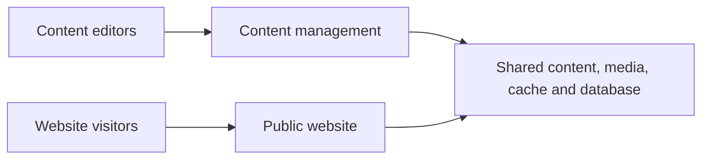
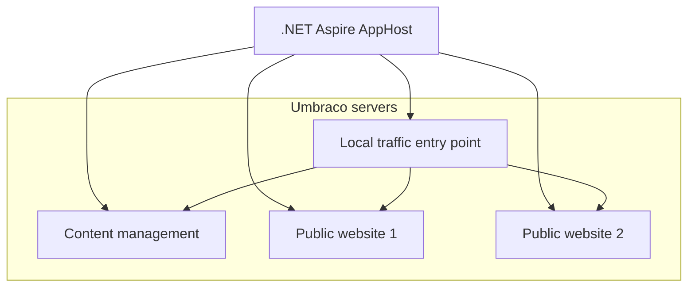
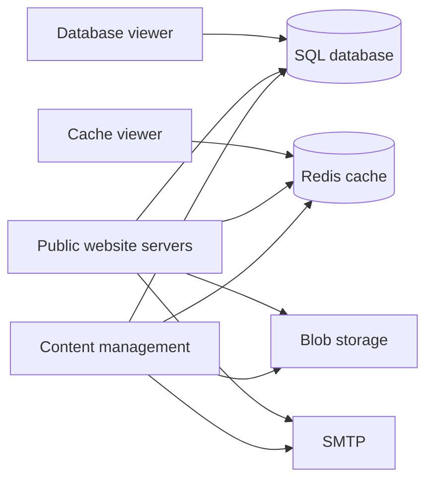

# Casko Defaults for Umbraco diagrams

These diagrams describe the local Aspire environment and the relationship between its Umbraco server roles and shared services.

## Publishing flow

## Server roles and routing

## Shared services

