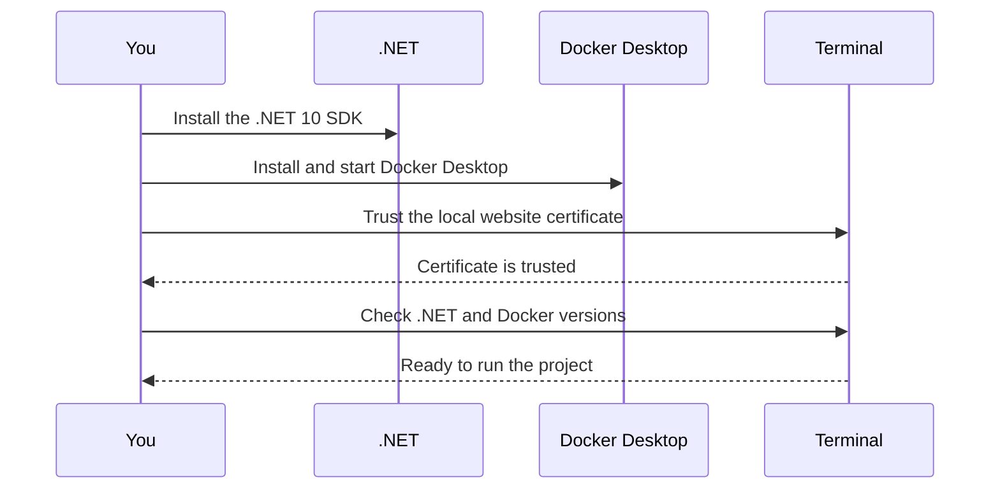

# Install the local environment

This guide prepares your computer to run the project. You only need to do these steps once.



## 1. Install .NET

Download the **.NET 10 SDK** for your operating system from the [official .NET download page](https://dotnet.microsoft.com/en-us/download/dotnet/10.0). Choose **SDK**, not Runtime, then follow the installer.

## 2. Install and start Docker Desktop

Docker Desktop runs the local database, cache, storage, and SMTP.

- [Windows installation](https://docs.docker.com/desktop/setup/install/windows-install/)
- [macOS installation](https://docs.docker.com/desktop/setup/install/mac-install/)
- [Linux installation](https://docs.docker.com/desktop/setup/install/linux/)

After installation, open Docker Desktop and wait until it reports that it is running.

Podman is supported as an alternative for people who already use it. Set `ASPIRE_CONTAINER_RUNTIME=podman` before starting the environment.

## 3. Trust the local website certificate

The local websites use secure `https` addresses. Open a terminal and run:

```powershell
dotnet dev-certs https --trust
```

On Windows and macOS, accept the confirmation. On Linux, certificate trust is specific to the distribution and browser; use [Microsoft's Linux certificate guidance](https://learn.microsoft.com/en-us/aspnet/core/security/enforcing-ssl?view=aspnetcore-10.0#trust-https-certificate-on-linux) if your browser reports a security warning.

## 4. Check that you are ready

From the project folder, run:

```powershell
dotnet --version
docker version
```

Both commands should return a version. The .NET version must begin with `10`.
