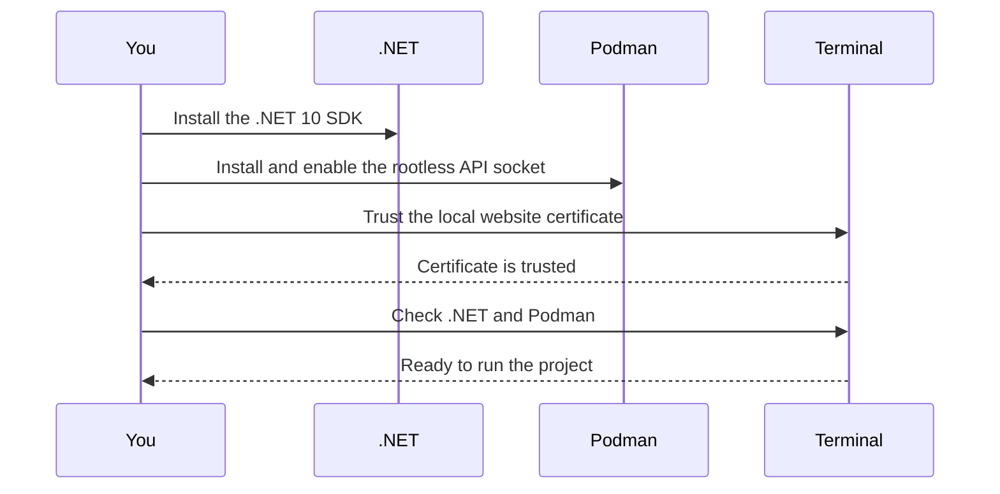

# Install the local environment

This guide prepares your computer to run the project. You only need to do these steps once.


```mermaid
sequenceDiagram
    participant You
    participant DotNet as .NET
    participant Podman as Podman
    participant Terminal

    You->>DotNet: Install the .NET 10 SDK
    You->>Podman: Install and enable the rootless API socket
    You->>Terminal: Trust the local website certificate
    Terminal-->>You: Certificate is trusted
    You->>Terminal: Check .NET and Podman
    Terminal-->>You: Ready to run the project
```

## 1. Install .NET

Download the **.NET 10 SDK** for your operating system from the [official .NET download page](https://dotnet.microsoft.com/en-us/download/dotnet/10.0). Choose **SDK**, not Runtime, then follow the installer.

## 2. Install Node.js

The Aspire-managed Astro frontend requires Node.js and npm. Install a current Node.js LTS release, then confirm it is available:

```powershell
node --version
npm --version
```

## 3. Install and start Podman

Rootless Podman runs the local database, cache, storage, and SMTP. Install Podman using your operating system's package manager, then enable its user-level API socket:

```bash
systemctl --user enable --now podman.socket
```

Configure Aspire to use Podman in your shell profile:

```bash
export ASPIRE_CONTAINER_RUNTIME=podman
export ASPIRE_DCP_USE_DEVELOPER_CERTIFICATE=false
```

The second setting makes Aspire use DCP's ephemeral certificate. It is required on Linux when the local development certificate is signed by a local certificate authority.

Open a new terminal and verify that the runtime is available:

```bash
podman info
```

## 4. Trust the local website certificate

The local websites use secure `https` addresses. Open a terminal and run:

```powershell
dotnet dev-certs https --trust
```

On Windows and macOS, accept the confirmation. On Linux, certificate trust is specific to the distribution and browser; use [Microsoft's Linux certificate guidance](https://learn.microsoft.com/en-us/aspnet/core/security/enforcing-ssl?view=aspnetcore-10.0#trust-https-certificate-on-linux) if your browser reports a security warning.

## 5. Check that you are ready

From the project folder, run:

```powershell
dotnet --version
node --version
podman info
```

All commands should succeed. The .NET version must begin with `10`.
