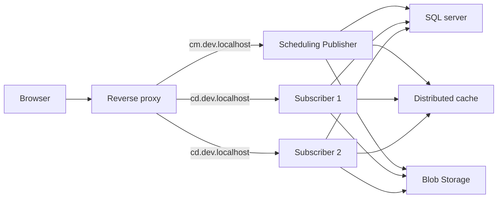

# Casko Defaults for Umbraco

## One content platform. Two purposeful experiences.

Casko Defaults for Umbraco is a ready-to-run local environment for teams building dependable Umbraco websites. It uses .NET Aspire to coordinate a dedicated content-management site, two public-site instances, and the local services they share.

Editors work in a focused backoffice while visitors use the public site through a single local entry point. SQL, Redis, blob storage, and SMTP are provisioned alongside the sites, so the development topology is visible, repeatable, and close to a scalable delivery setup.

s
Start here:

- [Install the local environment](INSTALL.md)
- [Run the environment](RUN.md)
- [Working agreement for contributors and coding agents](AGENTS.md)

See [the architecture diagrams](DIAGRAMS.md) for the logical flow, server roles, routing, and shared services.
