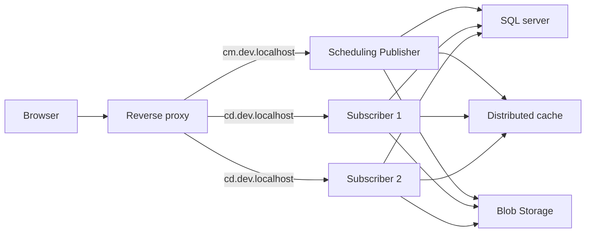

# Loadbalanced local Umbraco instances 
 > This project depend on MSSQL Server. The image used for MSSQL Server does not support ARM64 by default. Read [Full SQL Server on Apple Silicon with Podman](https://gist.github.com/hallojoe/cd0bc288afdeb0de7d4feceda37c4a03#full-sql-server-on-apple-silicon-with-podman)  

Casko Defaults for Umbraco is a ready-to-run local environment for running a single `SchedulingPublisher` and multiple `Subsriber`. It uses .NET Aspire to coordinate a dedicated backoffice site, two delivery instances, a standalone Astro frontend, and the local resources they share. Concrete local resource choices for this setup is: MSSQL Server, Azurite, Redis cache, and Mailpit.

## Get started

- [Install .NET and Docker](INSTALL.md)
- [Setup hostnames](HOSTS.md)
- [Run the environment](RUN.md)

## More

See [the architecture diagrams](DIAGRAMS.md) for the logical flow, server roles, routing, and shared resorces.

See also [Working agreement for contributors and coding agents](AGENTS.md)
