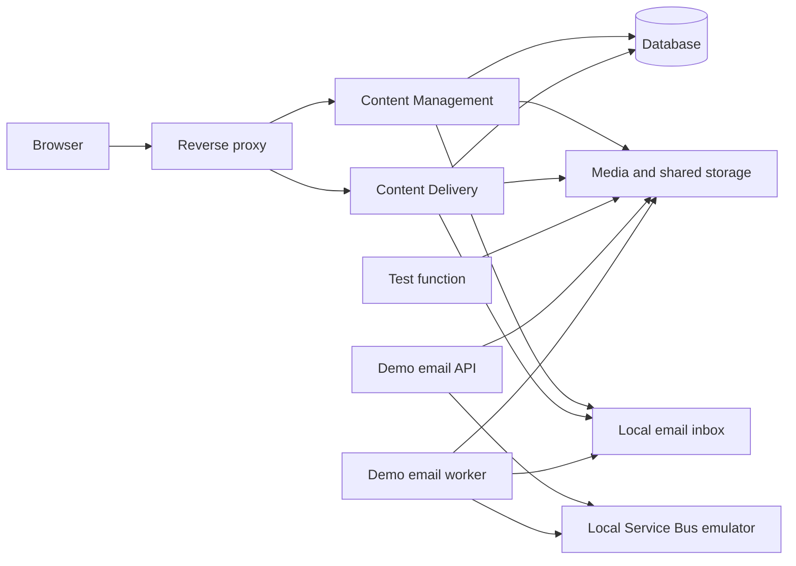

# Casko Defaults for Umbraco

This solution is an Umbraco setup orchestrated by .NET Aspire. It brings the website, supporting services, and local tools together as one application landscape, so they can be started, observed, and understood in one place.

## Prerequisites

- .NET 10 SDK
- Docker Desktop, running locally for the database, storage emulator, and local email inbox. Podman can be used instead by setting `ASPIRE_CONTAINER_RUNTIME=podman` before starting Aspire.
- An ASP.NET Core HTTPS development certificate trusted on the machine:

  ```powershell
  dotnet dev-certs https --trust
  ```

- Local hostname entries for the split website roles:

  ```text
  127.0.0.1 cm.dev.localhost
  127.0.0.1 cd.dev.localhost
  ```

- Azure Functions Core Tools v4 or later, verified with `func --version`

## The big picture



Aspire coordinates these parts and provides a dashboard where each service can be inspected while the system is running.

## What each part does

### Content Management (CM)

The Content Management site is where editors work. It hosts the Umbraco backoffice, manages content, and publishes changes for the public-facing site.

### Content Delivery (CD)

The Content Delivery site is the public-facing role. It serves the published website without exposing the editor backoffice.

### Reverse proxy

The reverse proxy is the front door for web traffic. It directs editor traffic to Content Management and public traffic to Content Delivery, keeping the two responsibilities separate while presenting friendly local addresses.

### Database

The database holds Umbraco content, configuration, and shared application data. Both website roles use the same database so that published content is consistent.

### Media and shared storage

Storage holds media files and the supporting shared data needed by the application. It allows both website roles to access the same files and coordination data.

### Local email inbox

Mailpit captures emails sent by the application. Instead of delivering messages to real recipients, it provides a safe inbox where emails can be inspected in a browser.

### Local Service Bus emulator

Aspire runs an Azure Service Bus emulator locally. The `outbound-email` queue is currently used only by the demo email API and worker; CM, CD, and the test function receive no Service Bus connection settings.

### Demo email sender

The email demo consists of an anonymous local API and a separate worker. `POST /emails` stores the plain-text payload in Azurite, then sends a compact `EmailRequested` message to `outbound-email`. The worker reads the payload and delivers it to Mailpit using SMTP.

After starting the AppHost, use the `email-queue-api` endpoint shown in the Aspire dashboard:

```powershell
$emailApi = "https://localhost:<email-queue-api-port>"

Invoke-RestMethod "$emailApi/emails" -Method Post -ContentType "application/json" -Body @'
{
  "to": "recipient@example.local",
  "subject": "Aspire email demo",
  "body": "This message was queued through Azurite and Service Bus."
}
'@
```

The API returns `202 Accepted` and an `emailId`. Open Mailpit through its `ui` endpoint in the Aspire dashboard to inspect the delivered message.

The worker receives up to 50 messages at a time, waits up to five seconds for a batch, and sends at most eight emails concurrently. It abandons transient storage, Service Bus, and SMTP errors for retry. Malformed messages, missing payload blobs, and SMTP 5xx responses are dead-lettered; the queue allows five delivery attempts and dead-letters expired messages. The local emulator limits the default TTL to one hour. A dead-letter reprocessor is intentionally not included.

Delivery receipts in blob storage suppress normal redelivery of the same `emailId`. SMTP and blob storage do not share an atomic transaction, so a process crash between SMTP delivery and receipt storage can still result in an at-least-once delivery edge case.

### Test function

The test function is a small HTTP service included to demonstrate that Azure Functions can run as part of the Aspire setup. Its echo endpoint responds with a simple status, timestamp, and optional name.

## How Aspire helps

Aspire defines the relationships between services rather than leaving each service to be configured in isolation. It supplies connection details at runtime, manages the local supporting services, and shows service health, logs, endpoints, and traces in its dashboard.

This keeps the system focused on the same shape it needs in a real environment: separate editing and delivery responsibilities, shared data services, safe email handling, and independently runnable background capabilities.

When the website runs through Aspire, its structured logs, HTTP traces, and runtime metrics are also available in the dashboard. Umbraco's normal log files continue to be written separately.
