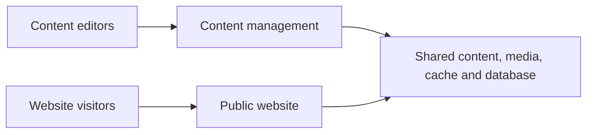

# Casko Defaults for Umbraco

## One content platform. Two purposeful experiences.

Casko Defaults for Umbraco is a ready-to-run local setup for teams building dependable Umbraco websites. It keeps content management separate from the public website while making both easy to explore in one place.

### Built for a confident publishing flow

- **A focused editor experience** — manage content in Umbraco without exposing the backoffice to website visitors.
- **A resilient public site** — run two public-site instances locally to reflect a scalable delivery setup.
- **Everything visible in one place** — the Aspire dashboard starts the environment and shows its health, activity, safe email inbox, and supporting services.

Start here:

- [Install the local environment](INSTALL.md)
- [Run the environment](RUN.md)
- [Working agreement for contributors and coding agents](AGENTS.md)
