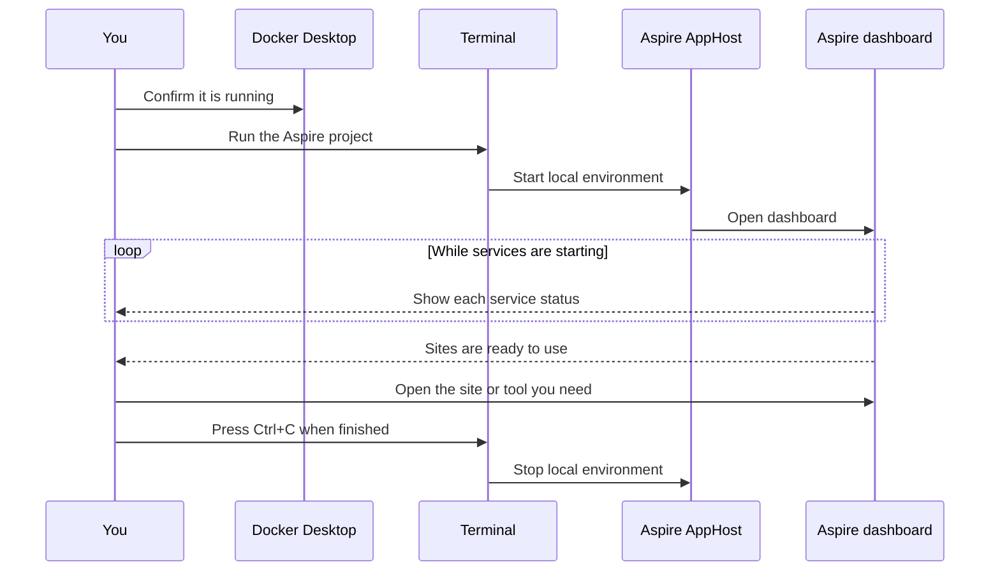

# Run the local environment

Make sure Docker Desktop or Podman is running, then open a terminal in `src/Casko.DefaultsForUmbraco.Aspire` and run:

```powershell
dotnet run --project src/Casko.DefaultsForUmbraco.Aspire
```

If you have Aspire CLI installed then:

```powershell
aspire start
```




Your browser opens the Aspire dashboard. The first start may take a few minutes while local services and container images are prepared.

When the dashboard shows the sites as running, open:

| What you want to do | Address |
| --- | --- |
| Manage content in Umbraco | `https://cm.dev.localhost:4443/umbraco/` |
| View the public website | `https://cd.dev.localhost:4443/` |
| View the Astro frontend | Open the `frontend` **http** link in the Aspire dashboard |
| View test emails | Open the `mailpit` **ui** link in the Aspire dashboard |
| Inspect the local database | Open the `dbgate` link in the Aspire dashboard |

Press `Ctrl+C` in the terminal to stop the environment.

## Build the Astro static site

The Astro site reads published Site 1 content from Umbraco's Delivery API while building. Keep the Aspire environment running, then run:

```powershell
npm --prefix src/Casko.DefaultsForUmbraco.Astro.UI run build
```

The default local Delivery API address is `https://cd.dev.localhost:4443`. The Astro scripts use Node's system certificate store so this trusted local HTTPS endpoint works during development and builds. For another environment, set `UMBRACO_DELIVERY_API_URL`, `UMBRACO_DELIVERY_START_ITEM`, and, when the API is private, `UMBRACO_DELIVERY_API_KEY` before building. See `src/Casko.DefaultsForUmbraco.Astro.UI/.env.example`.

## If the website addresses do not open

See HOSTS.md

## Useful options

Use the database-backed cache instead of the default Redis cache:

```powershell
$env:CASKO_DISTRIBUTED_CACHE_PROVIDER = "sql"
dotnet run --project src/Casko.DefaultsForUmbraco.Aspire
```

Start only the local database and its viewer:

```powershell
dotnet run --project src/Casko.DefaultsForUmbraco.Aspire --launch-profile sql-only
```
