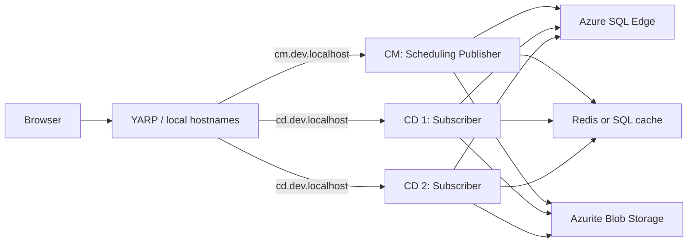

About

Casper, Developer at Charlie Tango / KMD.
Working with .NET since 1.1 and Umbraco since 4.x.
Long enough to remember when Razor became the obvious way to build templates.

---

The interesting bits of something boring

A show-and-tell about setting up a production-like Umbraco 17 environment on a local development machine.

Along the way we will touch:
- Docker / Podman
- .NET Aspire
- Umbraco 17
- Reverse proxies and local networking
- Storage, caching and infrastructure

---

Why are we doing this?

I recently got a new macOS machine and needed to rebuild my development environment.

Then I discovered it was ARM64.

Then I discovered SQL Server does not natively support ARM64 on macOS.

Then the crying started.

The practical local answer: Azure SQL Edge in a container.

```csharp
builder.AddSqlServer("sql", port: 11433)
    .WithImage("azure-sql-edge")
    .WithDataVolume("defaults-for-umbraco-sql-data");
```

That turned a boring workstation setup into a useful question:

How close can we get to a real production setup locally, without making local development painful?

---

What are we trying to model?

A simple load-balanced Umbraco setup:

Backoffice / CM
https://cm.dev.localhost
- Single instance
- Used by editors
- Scales up by adding resources to the machine
- Responsible for management and scheduled work

Delivery / CD
https://cd.dev.localhost
- One or more instances
- Serves public traffic
- Scales out by adding instances

The goal is not just to make Umbraco run.
The goal is to make the local topology resemble the real topology.

---

What does the environment need?

- SQL database
- Distributed cache: Redis or SQL
- Shared media storage: Blob Storage
- Reverse proxy / local virtual network
- SMTP server
- Persistent infrastructure volumes

Everything should be startable as one development environment.

Concrete local choices: Azure SQL Edge, Azurite, Redis or SQL cache, and Mailpit.

---

Enter .NET Aspire

Instead of installing and starting every dependency manually, Aspire becomes the composition layer for the development environment.

It describes:
- What services exist
- Which services depend on each other
- Ports and endpoints
- Containers and images
- Volumes
- Environment variables
- Connection strings
- Multiple Umbraco instances

The application topology becomes code.

```csharp
var storage = builder.AddAzureStorage("storage")
    .RunAsEmulator(x => x.WithDataVolume("defaults-for-umbraco-azurite-data"));
var blobs = storage.AddBlobs("blobs");
```

---

Infrastructure is only half the setup

Running the containers is the easy part.

Umbraco still needs to understand the topology it is running in.

We need to configure:
- TEMP storage
- Logs and temporary files
- Shared media / Blob Storage
- CM and CD URLs
- BackOfficeHost
- UmbracoApplicationUrl
- Forwarded headers / reverse proxy behaviour
- Examine storage and directory factories

One boring but important detail: each instance gets its own `TEMP`, `TMP`, and log file name.
Shared media belongs in Blob Storage; Lucene/Examine indexes stay local to the instance.

---

Umbraco server roles

The instances may run the same application, but they do not have the same responsibility.

CM / Scheduling Publisher
- Backoffice
- Scheduled publishing
- Background work
- The instance allowed to perform publisher responsibilities

CD / Subscriber
- Public delivery
- Receives distributed cache instructions
- Avoids publisher-only responsibilities

The role should be explicit and supplied by the environment rather than hidden in application code.

```csharp
.WithEnvironment("UMBRACO_SERVER_ROLE", "SchedulingPublisher") // CM
.WithEnvironment("UMBRACO_SERVER_ROLE", "Subscriber")           // CD
```

---

Configuration by environment and role

The same application needs different configuration depending on where and how it runs.

Think in layers:
- appsettings.json
- appsettings.Development.json
- role-specific configuration
- Development + role-specific configuration
- environment variables supplied by Aspire

Aspire describes the instance.
Umbraco configuration describes how that instance behaves.

```json
"BackOfficeHost": "https://cm.dev.localhost:4443",
"UmbracoApplicationUrl": "https://cd.dev.localhost:4443/"
```

---

The finished local topology



Umbraco instances
  -> SQL
  -> distributed cache
  -> Blob Storage
  -> SMTP

Aspire
  -> starts it
  -> connects it
  -> configures it
  -> lets us inspect it

The public route really does round-robin across two local delivery instances:

```json
"LoadBalancingPolicy": "RoundRobin"
```

---

What makes this useful?

We end up with more than a convenient way to start some containers.

We get a local environment that documents the intended production architecture.

A new developer should be able to clone the solution, start the Aspire AppHost and see the complete system come alive.

And if the topology changes, the development environment changes with it.

---

From here

Next we can walk through the setup piece by piece:

- Aspire AppHost
- SQL on ARM64
- Cache
- Blob Storage
- SMTP
- Reverse proxy and clean local hostnames
- Multiple Umbraco instances
- Server roles
- Umbraco configuration
- Storage and Examine
- Running and inspecting the finished environment

Suggested show-and-tell: publish in CM, refresh `cd.dev.localhost`, inspect Mailpit and the Aspire dashboard.
