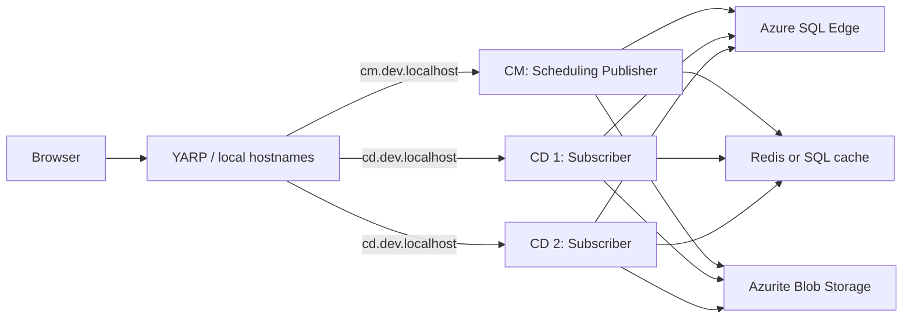

# The finished local topology

```mermaid
flowchart LR
  B[Browser] --> P[YARP / local hostnames]
  P -->|cm.dev.localhost| CM[CM: Scheduling Publisher]
  P -->|cd.dev.localhost| CD1[CD 1: Subscriber]
  P -->|cd.dev.localhost| CD2[CD 2: Subscriber]
  CM & CD1 & CD2 --> SQL[Azure SQL Edge]
  CM & CD1 & CD2 --> CACHE[Redis or SQL cache]
  CM & CD1 & CD2 --> BLOB[Azurite Blob Storage]
```

Umbraco instances also connect to SMTP.
