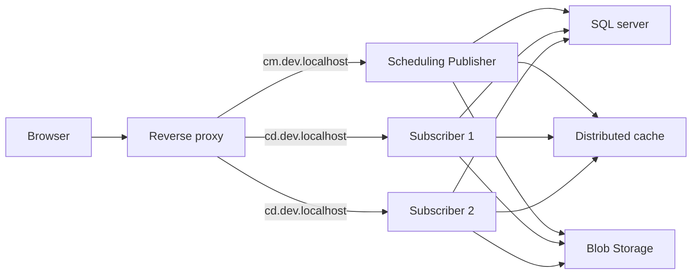

# What are we doing?

Somewhat the big picture:

```mermaid
flowchart LR
  B[Browser] --> P[Reverse proxy]
  P -->|cm.dev.localhost| CM[Scheduling Publisher]
  P -->|cd.dev.localhost| CD1[Subscriber 1]
  P -->|cd.dev.localhost| CD2[Subscriber 2]
  CM & CD1 & CD2 --> SQL[SQL server]
  CM & CD1 & CD2 --> CACHE[Distributed cache]
  CM & CD1 & CD2 --> BLOB[Blob Storage]
```
